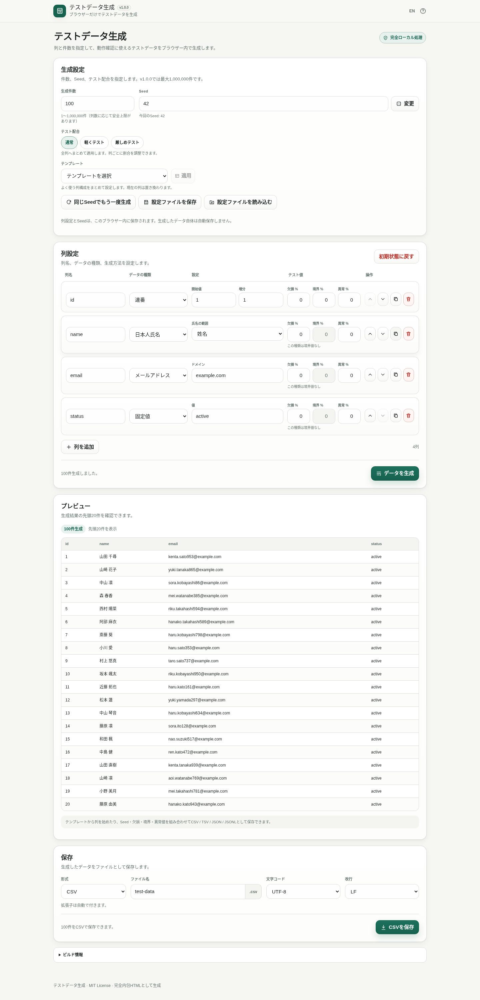

# Test Data Generator / テストデータ生成

[](https://github.com/ttomohisa/htmlapps-test-data-generator/actions/workflows/deploy-pages.yml)
[](LICENSE)
[](https://ttomohisa.github.io/htmlapps-test-data-generator/)

[English README](README.md)

列・件数・Seedを指定して、再現可能なテスト用データをブラウザー内で生成・保存するツールです。通常のダミーデータに加えて、欠損値・境界値・異常値を混ぜたテストデータも作成できます。生成とファイル保存はブラウザー内で完結します。

## アプリ

### [GitHub PagesでTest Data Generatorを開く](https://ttomohisa.github.io/htmlapps-test-data-generator/)

[](https://ttomohisa.github.io/htmlapps-test-data-generator/)

## 機能

- 1〜1,000,000件の生成件数指定（端末保護のため「件数 × 列数」は最大10,000,000セル）
- 大量生成をWeb Workerで実行し、画面操作を固めにくい構成
- 生成・保存の進捗表示と中止操作
- 生成時は全件を検証しつつ先頭20件だけを画面側へ保持し、保存時に同じSeed・設定からWorkerで再生成
- 大量データ保存は分割シリアライズしてBlobへまとめ、全行オブジェクトをメインスレッドへ保持しない
- テスト配合プリセット：**通常 / 軽くテスト / 厳しめテスト**
- 各列で **欠損 % / 境界 % / 異常 %** を個別設定
- 欠損値はJSON / JSONLでは `null`、CSV / TSVでは空欄として出力
- 数値・日付など7種類で範囲端や月末・年末・うるう日などの境界値を生成
- 全23種類で型や形式に応じた異常値を生成
- プレビュー上で欠損 / 境界 / 異常をバッジ表示し、出力データには補助列を追加しない
- Seedを指定して、同じ設定・件数から同じ生成結果を再現
- Seedを空欄にした場合は生成時に自動作成
- **同じSeedでもう一度生成** と **Seedを変更** を用意
- 件数・Seed・列設定だけを `test-data-schema.json` として保存 / 読み込み
- ユーザー / 顧客 / 社員 / 商品 / 注文 / 問い合わせ / アクセスログの7種類のテンプレート
- テンプレート適用時の上書き確認と、選択中テスト配合の引き継ぎ
- 列の追加・複製・削除（Undo）・並べ替え
- 既存14種類：連番、整数、小数、真偽値、UUID、ランダム文字列、選択肢、固定値、日付、日時、金額、パーセント、URL、IPv4
- 日本語9種類：日本人氏名、ふりがな、メールアドレス、電話番号、郵便番号、都道府県、市区町村、日本風住所、会社名
- 氏名の姓名 / 姓のみ / 名のみを切り替え
- ふりがなのひらがな / カタカナを切り替え
- メールドメイン、携帯電話 / 固定電話の生成種別を設定
- データ種類を「基本」「日本語データ」に分けて表示
- データ型ごとの生成前バリデーションと不正列の強調表示
- 全件をDOM描画せず先頭20件のみプレビュー
- CSV / TSV / JSON / JSONLとして保存
- CSV / TSVはUTF-8 / UTF-8 BOMを選択可能
- LF / CRLFの改行コードを選択可能
- ファイル名を変更でき、拡張子は形式に応じて自動付与
- カンマ、タブ、ダブルクォート、改行を含む値も壊れないようエスケープ
- 列設定をブラウザー内へ保存
- 日本語 / 英語UI、PC / スマートフォン対応
- 完全ローカル処理、実行時通信をCSPで遮断
- 通常の単一HTML版とgzip自己解凍版を生成可能

v1.0.0では日本語列同士は独立して生成します。たとえば「氏名」と「メール」は同じ人物に対応しません。テンプレートは列構成の初期設定であり、列同士の関連付けは行いません。詳細は [APP_SPEC.md](APP_SPEC.md) を参照してください。

## 使い方

1. 生成件数と、必要ならSeedを指定します。
2. 必要なら **通常 / 軽くテスト / 厳しめテスト** の配合を選びます。
3. 必要ならユーザー / 顧客 / 社員などのテンプレートを適用します。
4. 各列の列名・データの種類・テスト値を調整し、必要に応じて追加・複製・削除・並べ替えます。
5. **データを生成** を押します。Seedが空欄なら自動作成されます。
6. 生成結果の先頭20件、テスト値バッジ、実際に使用したSeedを確認します。
7. 保存形式とファイル名を選び、生成データを保存します。
8. 同じ構成を後で使う場合は **設定ファイルを保存** します。

## プライバシー

生成処理はブラウザー内で完結します。列設定や生成結果を外部サーバーへアップロードせず、分析タグやテレメトリも使用しません。日本語生成用の辞書もHTML内へ内包します。

列設定とSeedは、再読み込み後に復元できるようブラウザーのローカルストレージへ保存する場合があります。生成したデータ自体は自動保存しません。設定ファイルにも生成済みデータは含めず、件数・Seed・列設定だけを保存します。

Content Security Policyでは `connect-src 'none'` を設定しています。

## 開発

`htmlapps-template` の単一HTMLアプリ構成に準拠しています。変更前に [AGENTS.md](AGENTS.md) と [APP_SPEC.md](APP_SPEC.md) を確認してください。

編集するアプリ本体：

```text
src/index.template.html
```

`dist/` の生成済みHTMLは直接編集しません。

## ビルド

Windows 10/11で：

```bat
build-standalone.bat
```

生成物：

```text
dist/
├─ index.html
├─ index.self-extract.html
├─ dependency-manifest.json
├─ build-size-report.json
├─ self-extract-manifest.json
└─ .nojekyll
```

ビルド済みの通常版をWindowsで直接開く場合：

```bat
start-local.bat
```

## 対応ブラウザー

現行のデスクトップ / モバイル版 Chromium、Firefox、Safariを対象とします。テンプレートの方針に従い、`file://` での直接起動も対象です。

## ライセンス

[MIT License](LICENSE)

### 編集と保存時の動作

- 数値設定は空欄にせず入力します。範囲内であれば `0` を明示的に指定できます。
- 設定やSeedを変更すると実行中の生成・保存を中止し、保存前に再生成が必要になります。
- 列の移動や種類変更でもキーボードのフォーカスを保持します。削除後は隣の列名、元に戻した後は復元した列名へ移ります。
- `sample.csv` をJSONで保存すると `sample.json` になります。空欄のファイル名には `test-data` を使います。
- 回帰テストにはNode.js 22以降が必要です（CIは24）。リポジトリ検査はソースと配布用HTMLを検証し、通常ビルドはルートの `test-data-generator.html` も更新します。
